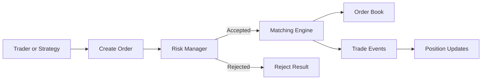
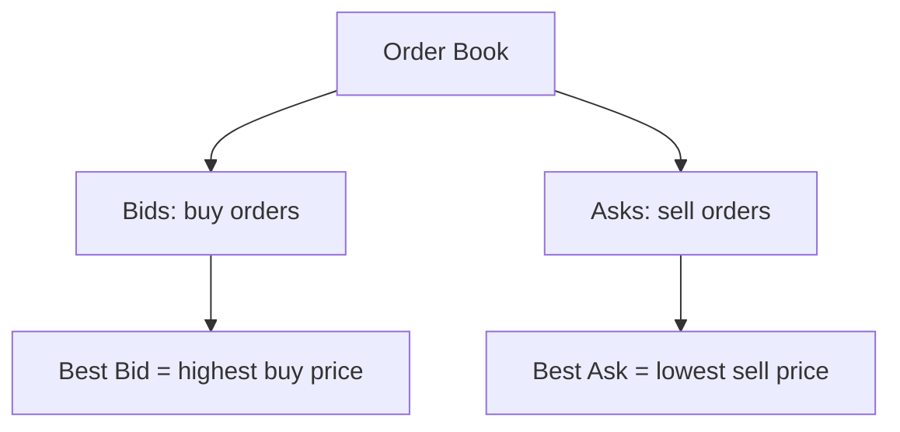
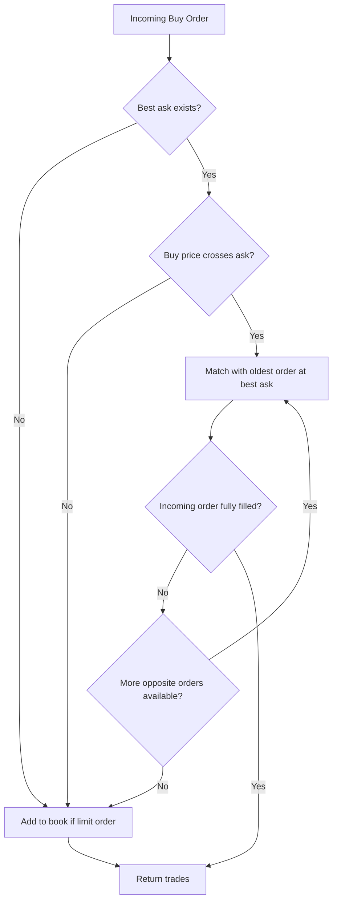
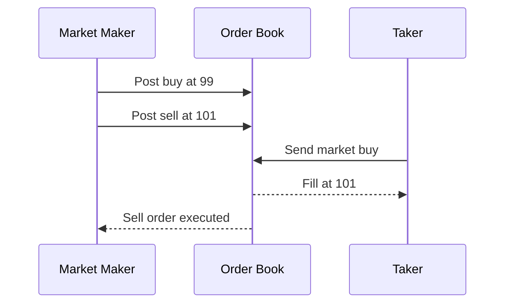

# Trading Simulator Architecture Flow

This page shows the simulator flow in small diagrams so you can connect the trading concepts to the code.

## 1) High-Level Request Flow

Meaning:

- A trader or strategy sends an order.
- Risk checks run before matching.
- If accepted, the matching engine tries to trade it.
- If it does not fully trade, remaining quantity can rest in the order book.
- Any executed trade updates positions.

## 2) Order Book Structure

Meaning:

- `Bids` are people willing to buy.
- `Asks` are people willing to sell.
- The best bid is the highest buy price.
- The best ask is the lowest sell price.

## 3) Matching Flow For An Incoming Buy

Meaning:

- A buy order only trades against sell orders.
- It starts at the best ask.
- If the buy order is aggressive enough, it consumes liquidity.
- If it still has quantity left and it is a limit order, it rests in the book.

## 4) Market Maker vs Taker

Meaning:

- The market maker places resting quotes.
- The taker wants immediate execution.
- The taker trades at the current best available price.
- The maker earns the spread only if it can buy lower and sell higher over time.

## 5) Code Mapping

- Order creation and demo flow: `src/main/java/com/lowlatencylab/sim/Main.java`
- Risk checks: `src/main/java/com/lowlatencylab/sim/risk/RiskManager.java`
- Matching logic: `src/main/java/com/lowlatencylab/sim/engine/MatchingEngine.java`
- Book state: `src/main/java/com/lowlatencylab/sim/book/OrderBook.java`
- Market-maker quotes: `src/main/java/com/lowlatencylab/sim/strategy/NaiveMarketMakerStrategy.java`